In command line interfaces, there are some characters you'll want to enter frequently which don't otherwise show up very often when you're typing. This guide is meant to help you find those keys.

# Individual Keys

## <code>\`</code> "back tick"

This is importantly not the same as your familiar apostrophe key.

<figure>

<figcaption aria-hidden="true">backtick on the tenkeyless keyboard</figcaption>
</figure>

<figure>
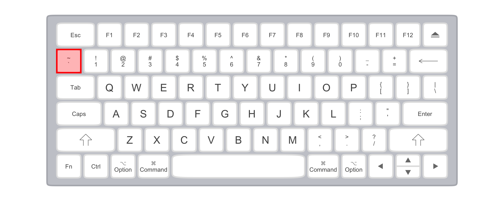
<figcaption aria-hidden="true">backtick on the mac keyboard</figcaption>
</figure>

## `\` backslash

This symbol is used to separate directory names in DOS, but is more usually used as an "escape" character. It is **importantly** different from the forward slash symbol, `/`.

<figure>

<figcaption aria-hidden="true">backslash on the tenkeyless keyboard</figcaption>
</figure>

<figure>
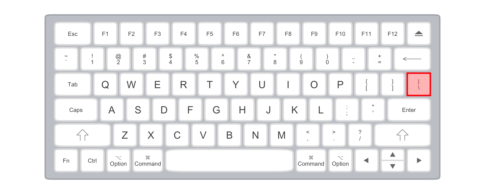
<figcaption aria-hidden="true">backslash on the mac keyboard</figcaption>
</figure>

## `/` slash, or forward slash

While we're on the subject, here's forward slash, used to separate directories on Unix-like systems (including macOS).

<figure>
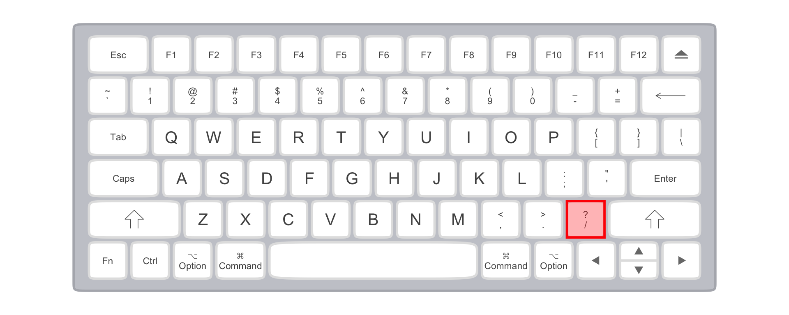
<figcaption aria-hidden="true">slash on the tenkeyless keyboard</figcaption>
</figure>

<figure>

<figcaption aria-hidden="true">slash on the mac keyboard</figcaption>
</figure>

### `[` and `]` square brackets

These have a number of different uses in programming languages. Usually when you have an "open" bracket `[` you need to make sure that you "close" it `]`.

### `~` tilde

This symbol is used as a shortcut for your home directory in unix-like systems, and for many other purposes

<figure>
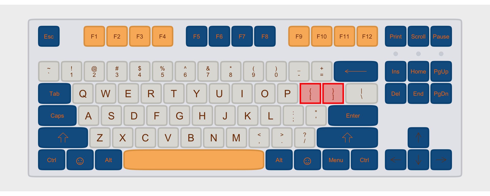
<figcaption aria-hidden="true">square brackets on the tenkeyless keyboard</figcaption>
</figure>

<figure>
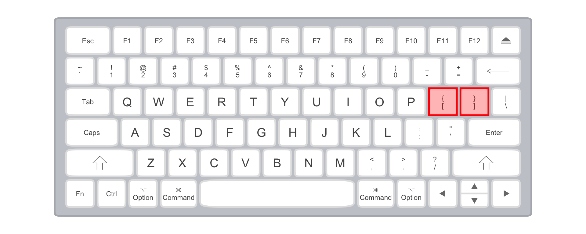
<figcaption aria-hidden="true">tilde on the mac keyboard</figcaption>
</figure>

## Modified Keys

You get the following symbols by holding Shift + another key.

### `~` tilde

This symbol is used as a shortcut for your home directory in unix-like systems, and for many other purposes

<figure>
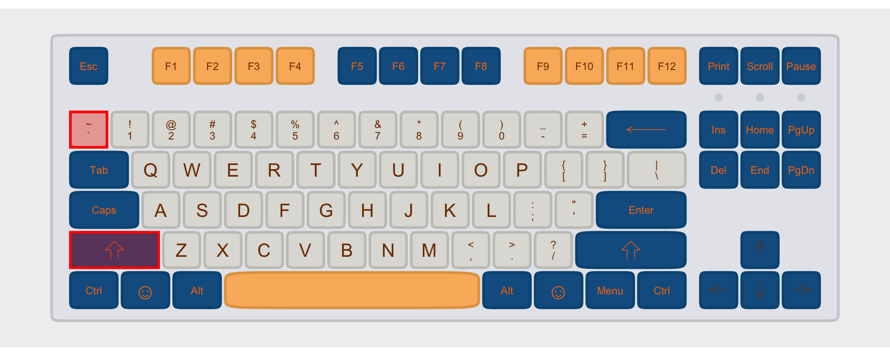
<figcaption aria-hidden="true">tilde on the tenkeyless keyboard</figcaption>
</figure>

<figure>
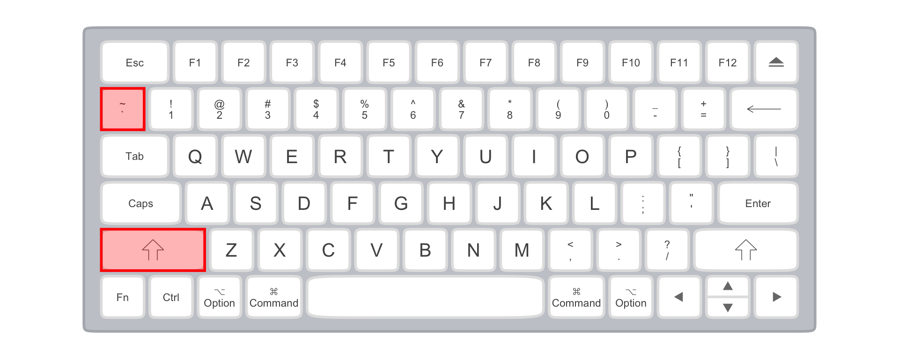
<figcaption aria-hidden="true">tilde on the mac keyboard</figcaption>
</figure>

### `^` caret

This symbol is *sometimes* used to indicate the Control key on a Mac keyboard, but usually it's the caret.

<figure>
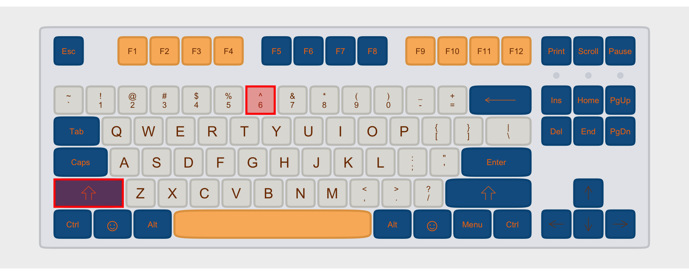
<figcaption aria-hidden="true">caret on the tenkeyless keyboard</figcaption>
</figure>

<figure>

<figcaption aria-hidden="true">caret on the mac keyboard</figcaption>
</figure>

### `_` underscore

Underscores are often used in file and variable names.

### `~` tilde

This symbol is used as a shortcut for your home directory in unix-like systems, and for many other purposes

<figure>
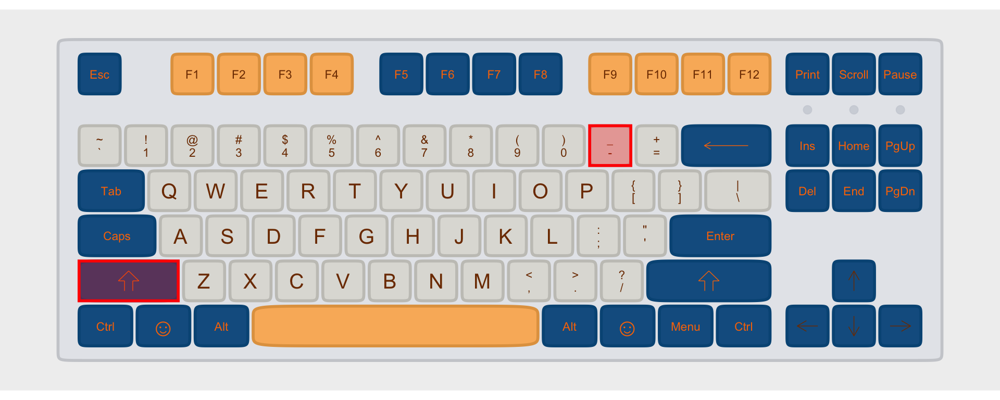
<figcaption aria-hidden="true">underscore on the tenkeyless keyboard</figcaption>
</figure>

<figure>
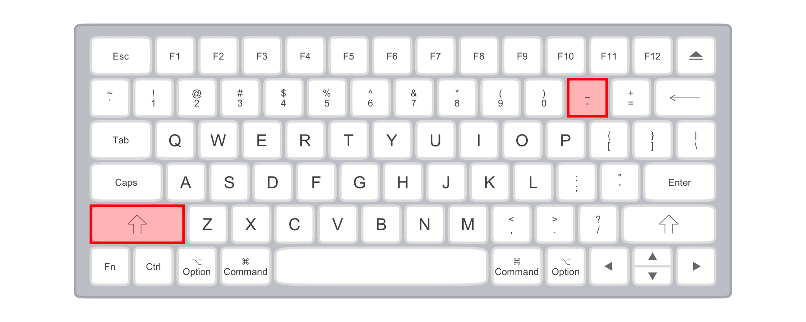
<figcaption aria-hidden="true">underscore on the mac keyboard</figcaption>
</figure>

### `{` and `}` curly brackets

A lot like the square brackets, these serve a number of different uses. And again, when you have an open backet `{` you'll want to make sure you close it `}`.

<figure>
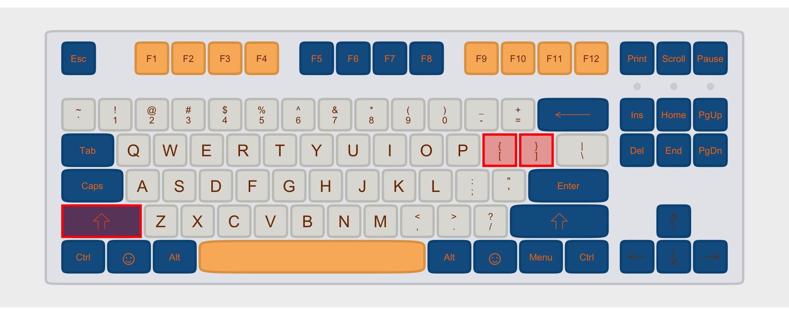
<figcaption aria-hidden="true">curly brackets on the tenkeyless keyboard</figcaption>
</figure>

<figure>
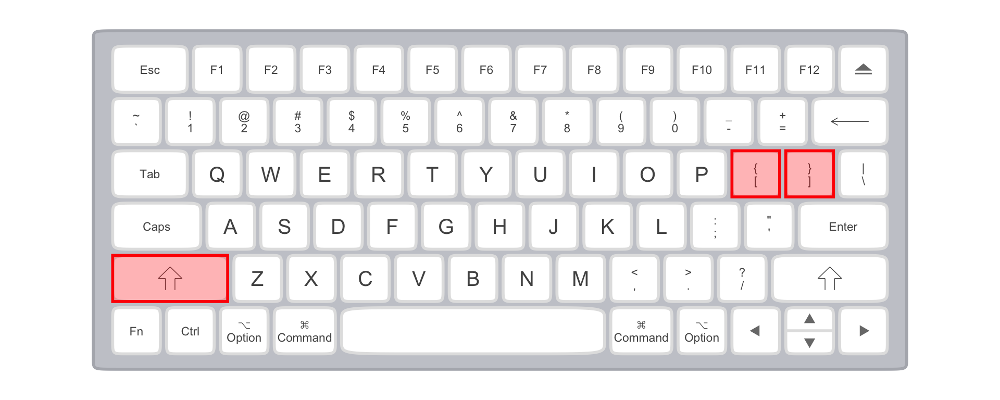
<figcaption aria-hidden="true">curly brackets on the mac keyboard</figcaption>
</figure>

### `|` pipe *or* bar

This vertical line often means "or" in programming languages.

<figure>

<figcaption aria-hidden="true">bar location on the tenkeyless keyboard</figcaption>
</figure>

<figure>

<figcaption aria-hidden="true">bar brackets on the mac keyboard</figcaption>
</figure>

### `<` and `>` less than & greater than *or* angle brackets

Sometimes the symbols `<` and `>` are used for their mathematical meaning of
"less than" and "greater than." Other times they're used as brackets, a lot
like the square or curly brackets.

<figure>
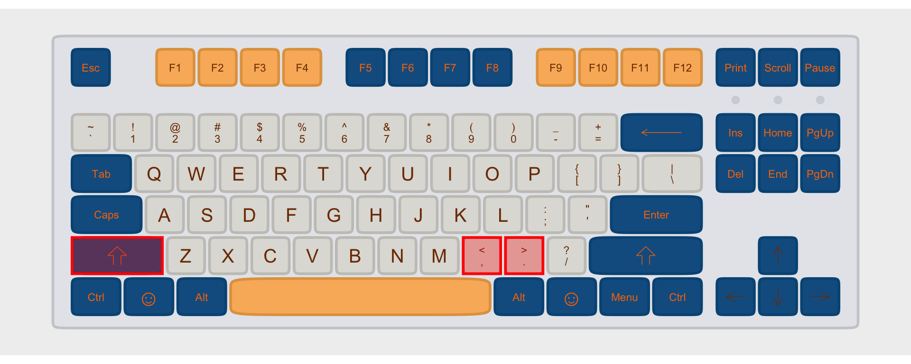
<figcaption aria-hidden="true">angle bracket location on the tenkeyless keyboard</figcaption>
</figure>

<figure>

<figcaption aria-hidden="true">angle bracket location on the tenkeyless keyboard</figcaption>
</figure>

## Modifier Combos

Sometimes you'll see key combinations suggested to help you use the command line
and other programming languages. For example, the key combo `Control+C` or `Ctrl+C`
will end whatever process is running in a Unix-like system. What this notation means
is that you should press the `Control` key, and while continuing to hold it, press
the `C` key.

<figure>
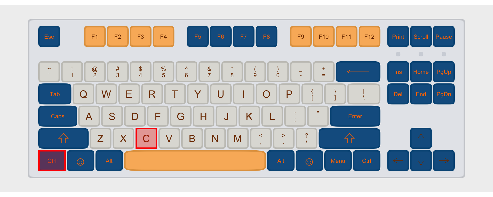
<figcaption aria-hidden="true">Ctrl+C location on the tenkeyless keyboard</figcaption>
</figure>

<figure>
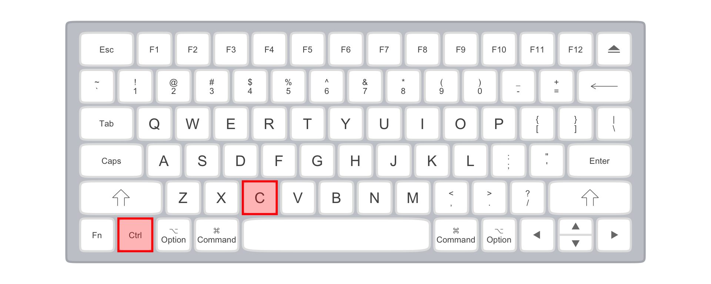
<figcaption aria-hidden="true"><code>Ctrl+C</code> location on the tenkeyless keyboard</figcaption>
</figure>

\`\`\`
