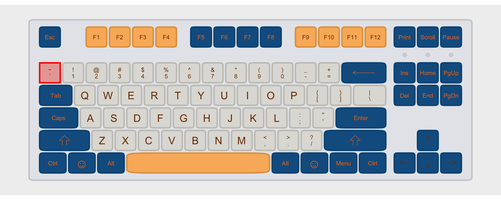

## Keyboarding for the command line

In command line interfaces, there are some characters you'll want to enter frequently which don't otherwise show up very often when you're typing. This guide is meant to help you find those keys.

# Individual Keys

## <code>\`</code> "back tick"

This is importantly not the same as your familiar apostrophe key.

<figure>

<figcaption aria-hidden="true">backtick on the tenkeyless keyboard</figcaption>
</figure>

<figure>

<figcaption aria-hidden="true">backtick on the mac keyboard</figcaption>
</figure>

## `\` backslash

This symbol is used to separate directory names in DOS, but is more usually used
as an "escape" character. It is **importantly** different from the forward
slash symbol, `/`.

<figure>

<figcaption aria-hidden="true">backslash on the tenkeyless keyboard</figcaption>
</figure>

<figure>

<figcaption aria-hidden="true">backslash on the mac keyboard</figcaption>
</figure>

## `/` slash, or forward slash

While we're on the subject, here's forward slash, used to separate directories
on Unix-like systems (including macOS).

<figure>

<figcaption aria-hidden="true">slash on the tenkeyless keyboard</figcaption>
</figure>

<figure>

<figcaption aria-hidden="true">slash on the mac keyboard</figcaption>
</figure>

## `^` "caret"

*Sometimes* you might see the symbol `^` used to indicate the control key on a
Mac keyboard. But usually you'll want to be using this symbol.

<figure>

<figcaption aria-hidden="true">caret on the mac keyboard</figcaption>
</figure>
